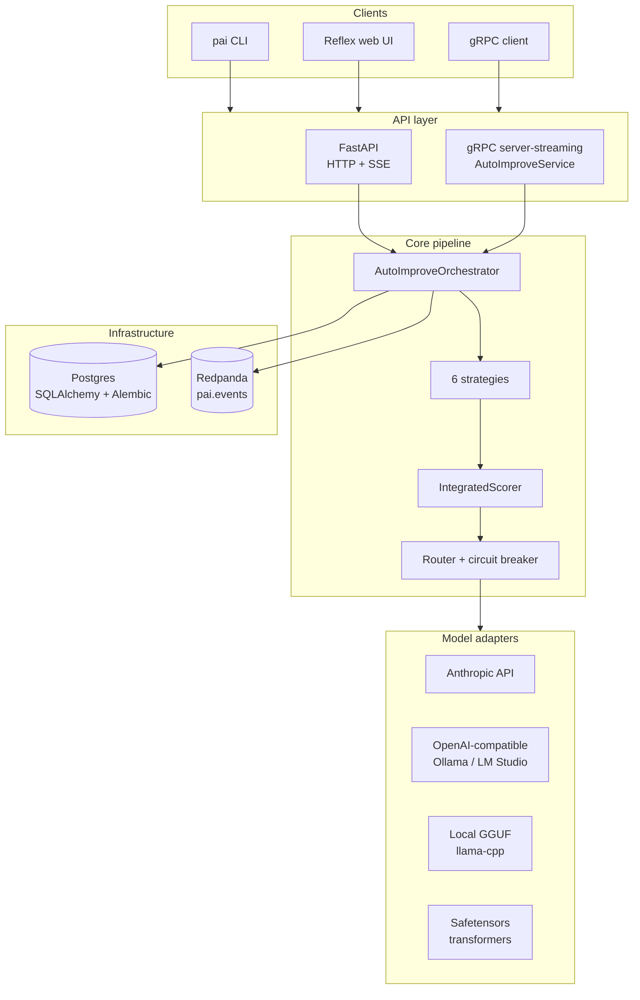
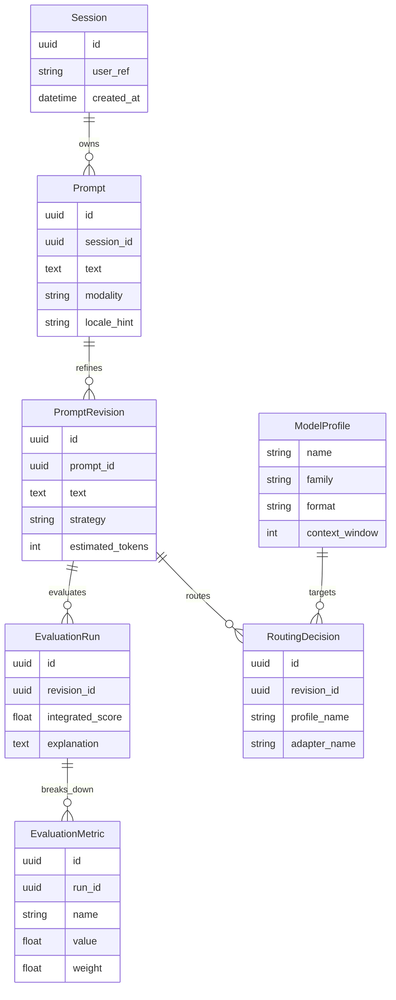

# Ճարտարապետություն

`prompt-autoimprove`-ը կազմակերպված է որպես համագործակցող մոդուլների ամբողջություն, որոնք կարող են աշխատել մեկ Python պրոցեսի ներսում կամ բաժանվել անկախ տեղակայվող ծառայությունների։ pipeline-ի կառուցվածքը նույնն է մնում երկու ռեժիմներում էլ։

## Pipeline

```mermaid
flowchart LR
    user([Raw prompt]) --> normalizer[Normalizer]
    normalizer --> selector[Strategy selector]
    selector --> generator[Candidate generator]
    generator --> validator[Validator]
    validator --> evaluator[Evaluator]
    evaluator --> router[Router]
    router --> adapter[Model adapter]
    adapter --> probation[Probation probe]
    probation --> explainer[Explainer]
    explainer --> result([Final decision])
```

## Բաղադրիչների գրաֆ

## Բաղադրիչներ

| Module | Responsibility |
| --- | --- |
| `core/normalizer` | Հայտնաբերում է լեզուն, դասակարգում է task-ի տիպը, գտնում է բացակայող պարամետրերը և քողարկում է PII-ն։ |
| `core/strategies/*` | Նորմալացված prompt-ից արտադրում է բարելավված թեկնածուներ։ |
| `core/strategy_selector` | Ընտրում է ստրատեգիաներ `TaskType`-ի և `ModelProfile`-ի զույգի համար։ |
| `core/validator` | Ստուգում է երկարությունը, հակասությունները, ֆորմատը և անվտանգության սահմանափակումները։ |
| `core/evaluator` | Կիրառում է ինտեգրված գնահատականի բանաձևը և վերադարձնում է ըստ մետրիկաների մանրամասնում։ |
| `core/explainer` | Հաղթող թեկնածուի համար ստեղծում է մարդ-ընթեռնելի հիմնավորում։ |
| `adapters/*` | Իրականացնում է `ModelAdapter`-ը GGUF-ի, HF safetensors-ի, OpenAI-compatible HTTP-ի և Anthropic-ի համար։ |
| `adapters/circuit_breaker` | Անջատվում է `k` հաջորդական ձախողումից հետո և կիսաբացվում է reset-ի պատուհանից հետո։ |
| `registry` | Բեռնում է YAML `ModelProfile` սահմանումները։ |
| `routing` | Ընտրում է տեղակայման թիրախ՝ ելնելով հասանելիության, անվտանգության և արժեքի սահմանափակումներից։ |
| `services/orchestrator` | Միացնում է pipeline-ը և փուլերի անցումների ժամանակ արձակում է Kafka իրադարձություններ։ |
| `api/http` | FastAPI backend՝ API-key auth-ով, rate limiting-ով և SSE streaming-ով։ |
| `api/grpc` | `AutoImproveService` server-streaming gRPC ծառայություն։ |
| `persistence` | SQLAlchemy 2 async ORM և Alembic միգրացիաներ։ |

## Տվյալների մոդել

## Գործարկման միջավայրի սկզբնավորում

`prompt_autoimprove.bootstrap.build_runtime`-ը մեկ անգամ կառուցում է ընդհանուր pipeline-ի գործարկման միջավայրը (պրոֆիլներ, ադապտերներ, դասակարգիչ, rewriter, պահեստի սեսիաների ֆաբրիկա, իրադարձությունների publisher), և՛ HTTP հավելվածի lifespan-ը, և՛ gRPC սերվերն օգտագործում են այն, այնպես որ երկու transport-ները բացահայտում են նույնական հնարավորություններ։ HTTP պրոցեսը gRPC `AutoImproveService`-ը գործարկում է որպես asyncio task նույն event loop-ում, երբ `PAI_API__GRPC_ENABLED`-ը true է (լռելյայն). սա ենթադրում է մեկ worker։ Multi-worker տեղակայումների համար gRPC-ն գործարկեք որպես առանձին պրոցես (`pai serve-grpc` կամ `python -m prompt_autoimprove.api.grpc.server`)։

Սխեմայի սեփականությունը պատկանում է Alembic-ին։ docker compose-ի ներքո մեկանգամյա `migrate` ծառայությունը գործարկում է `alembic upgrade head` հավելվածի մեկնարկից առաջ. հավելվածն այլևս bootstrap-ի ժամանակ աղյուսակներ չի ստեղծում, եթե `PAI_DB__AUTO_CREATE`-ը կարգավորված չէ։

## Տեղակայման տոպոլոգիաներ

1. **All-in-one**: մեկ Python պրոցես լոկալ փորձարկումների, CI-ի և փոքր դեմոների համար։
2. **Split services**: հանրային backend-ը, օրկեստրատորը և ադապտերներն աշխատում են որպես առանձին կոնտեյներներ. վիճակը պահվում է PostgreSQL-ում, իսկ իրադարձությունները հոսում են Kafka-ի միջով։

## Կոդի կառուցվածք

Դոմենի տիպերն ապրում են `prompt_autoimprove.domain`-ում և խուսափում են I/O-ից։ Կողմնակի էֆեկտներ ունեցող կոդը protocol-ների հետևում է `adapters/`-ում և `persistence/`-ում, մինչդեռ API transport-ի տրամաբանությունը մնում է `api/http`-ում և `api/grpc`-ում։
