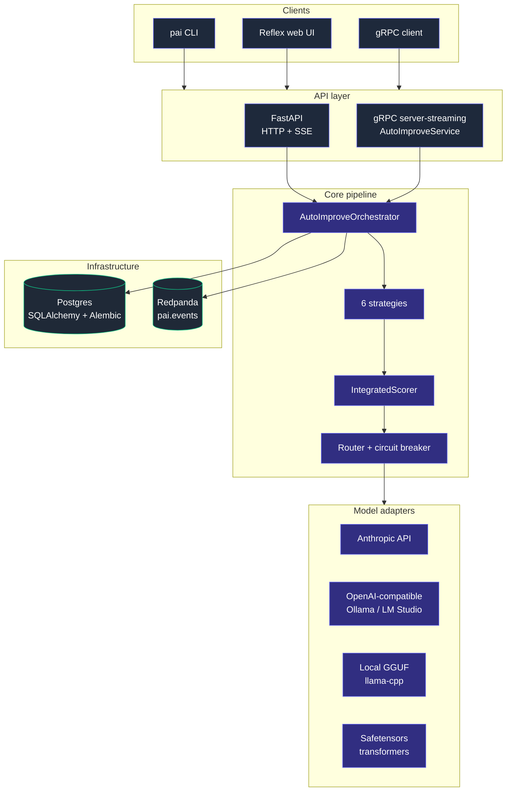
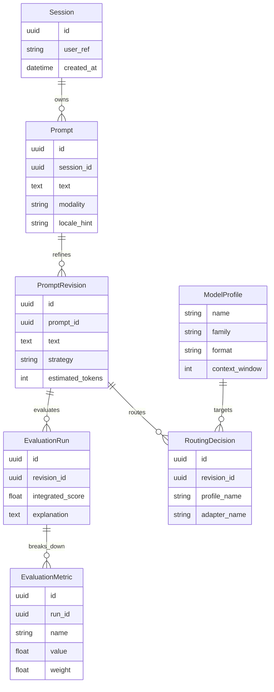

# Architecture

`prompt-autoimprove` is organized as a set of cooperating modules that may be
deployed in-process or split into independent services. The end-to-end pipeline
is the same in both deployments.

## Pipeline

## Component graph

## Components

| Module          | Responsibility                                                                |
| --------------- | ----------------------------------------------------------------------------- |
| `core/normalizer`      | Detects language, classifies task type, finds missing parameters, redacts PII. |
| `core/strategies/*`    | Six strategies that produce improved candidates from a normalized prompt. |
| `core/strategy_selector` | Picks a subset of strategies given $(\text{TaskType}, \text{ModelProfile})$. |
| `core/validator`       | Static checks: length, contradictions, format, safety.                 |
| `core/evaluator`       | Integrated score formula; produces `Score` and per-metric breakdown.  |
| `core/explainer`       | Human-readable reasoning for the winning candidate.                    |
| `adapters/*`           | `ModelAdapter` implementations: GGUF (llama-cpp), HF safetensors, OpenAI-compatible HTTP, Anthropic. |
| `adapters/circuit_breaker` | Trips after $k$ consecutive failures, half-opens after a reset window. |
| `registry`             | Loads YAML `ModelProfile`s.                                             |
| `routing`              | Picks a deployment target based on availability, security, cost budget. |
| `services/orchestrator`| Wires the pipeline; emits Kafka events on each stage transition.        |
| `api/http`             | FastAPI public backend with API-key auth, rate limiting, SSE stream. |
| `api/grpc`             | `AutoImproveService` server-streaming gRPC service.                     |
| `persistence`          | SQLAlchemy 2 async ORM + Alembic migrations.                            |

## Data model

## Deployment topologies

1. **All-in-one** — single Python process; great for local experiments and CI.
2. **Split** — public backend, orchestrator, and adapters run as separate
   containers, communicating over gRPC; events on Kafka; state in PostgreSQL.

## Source layout

See the top-level README for the directory tree. Domain types live in
`prompt_autoimprove.domain` and are pure dataclasses with no I/O. All
side-effecting code lives behind the protocols in `adapters/` and `persistence/`.
