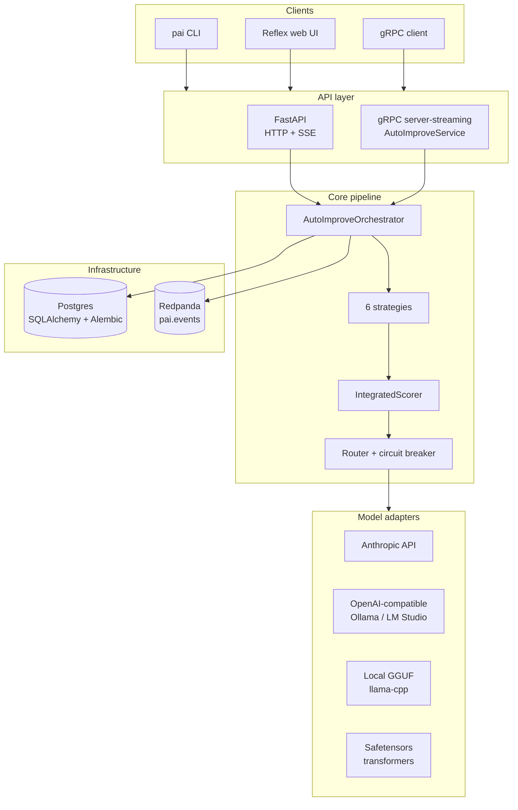
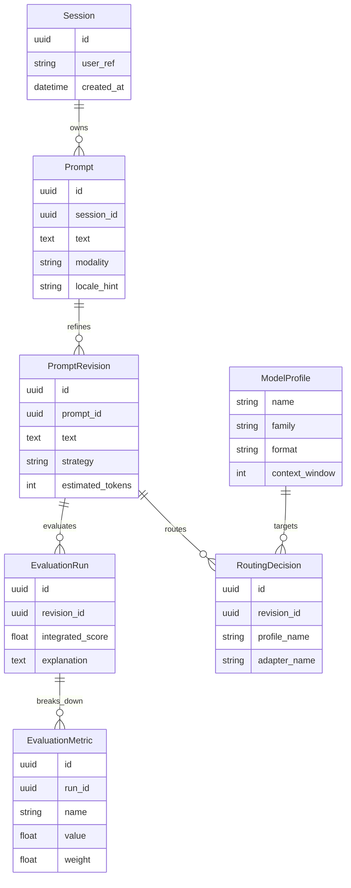

# Architecture

`prompt-autoimprove` is organized as a set of cooperating modules that can run
inside one Python process or be split into independently deployed services. The
pipeline shape stays the same in both modes.

## Pipeline

```mermaid
flowchart LR
    user([Raw prompt]) --> normalizer[Normalizer]
    normalizer --> selector[Strategy selector]
    selector --> generator[Candidate generator]
    generator --> validator[Validator]
    validator --> evaluator[Evaluator]
    evaluator --> router[Router]
    router --> adapter[Model adapter]
    adapter --> probation[Probation probe]
    probation --> explainer[Explainer]
    explainer --> result([Final decision])
```

## Component graph

## Components

| Module | Responsibility |
| --- | --- |
| `core/normalizer` | Detects language, classifies task type, finds missing parameters, and redacts PII. |
| `core/strategies/*` | Produces improved candidates from a normalized prompt. |
| `core/strategy_selector` | Selects strategies for a pair of `TaskType` and `ModelProfile`. |
| `core/validator` | Checks length, contradictions, format, and safety constraints. |
| `core/evaluator` | Applies the integrated score formula and returns a per-metric breakdown. |
| `core/explainer` | Creates human-readable reasoning for the winning candidate. |
| `adapters/*` | Implements `ModelAdapter` for GGUF, HF safetensors, OpenAI-compatible HTTP, and Anthropic. |
| `adapters/circuit_breaker` | Trips after `k` consecutive failures and half-opens after a reset window. |
| `registry` | Loads YAML `ModelProfile` definitions. |
| `routing` | Picks a deployment target from availability, security, and cost constraints. |
| `services/orchestrator` | Wires the pipeline and emits Kafka events on stage transitions. |
| `api/http` | FastAPI backend with API-key auth, rate limiting, and SSE streaming. |
| `api/grpc` | `AutoImproveService` server-streaming gRPC service. |
| `persistence` | SQLAlchemy 2 async ORM and Alembic migrations. |

## Data model

## Runtime bootstrap

`prompt_autoimprove.bootstrap.build_runtime` builds the shared pipeline runtime
(profiles, adapters, classifier, rewriter, persistence session factory, event
publisher) once, and both the HTTP app lifespan and the gRPC server consume it,
so the two transports expose identical capabilities. The HTTP process starts the
gRPC `AutoImproveService` as an asyncio task in the same event loop when
`PAI_API__GRPC_ENABLED` is true (the default); this assumes a single worker. For
multi-worker deployments run gRPC as its own process (`pai serve-grpc` or
`python -m prompt_autoimprove.api.grpc.server`).

Schema ownership belongs to Alembic. Under docker compose a one-shot `migrate`
service runs `alembic upgrade head` before the app starts; the app no longer
creates tables on boot unless `PAI_DB__AUTO_CREATE` is set.

## Deployment topologies

1. **All-in-one**: one Python process for local experiments, CI, and small demos.
2. **Split services**: public backend, orchestrator, and adapters run as
   separate containers; state lives in PostgreSQL and events flow through Kafka.

## Source layout

Domain types live in `prompt_autoimprove.domain` and avoid I/O. Side-effecting
code is behind protocols in `adapters/` and `persistence/`, while API transport
logic stays in `api/http` and `api/grpc`.
