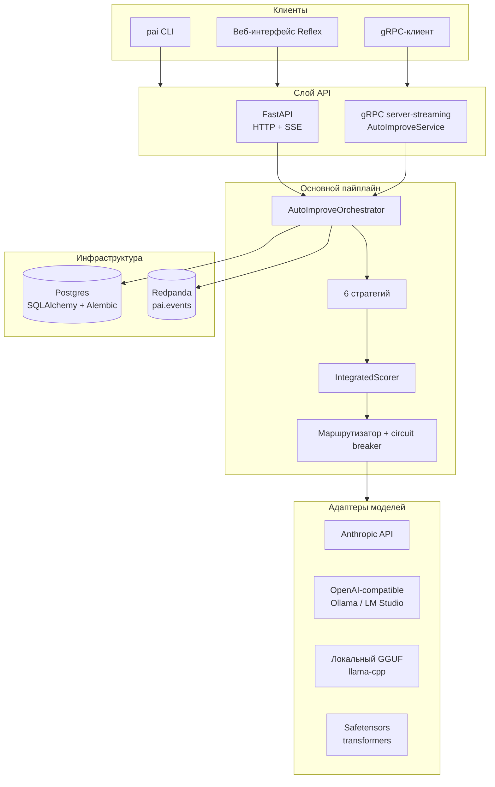
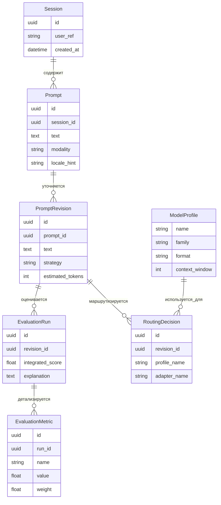

# Архитектура

`prompt-autoimprove` состоит из взаимодействующих модулей, которые можно
запускать в одном Python-процессе или разделять на независимые сервисы. Форма
пайплайна в обоих режимах остается одинаковой.

## Пайплайн

## Граф компонентов

## Компоненты

| Модуль | Ответственность |
| --- | --- |
| `core/normalizer` | Определяет язык, классифицирует тип задачи, ищет недостающие параметры и редактирует PII. |
| `core/strategies/*` | Создает улучшенные кандидаты из нормализованного промпта. |
| `core/strategy_selector` | Выбирает стратегии для пары `TaskType` и `ModelProfile`. |
| `core/validator` | Проверяет длину, противоречия, формат и ограничения безопасности. |
| `core/evaluator` | Применяет интегральную формулу оценки и возвращает разбивку по метрикам. |
| `core/explainer` | Формирует человекочитаемое объяснение выбора победителя. |
| `adapters/*` | Реализует `ModelAdapter` для GGUF, HF safetensors, OpenAI-compatible HTTP и Anthropic. |
| `adapters/circuit_breaker` | Открывается после `k` последовательных сбоев и half-open после окна сброса. |
| `registry` | Загружает YAML-описания `ModelProfile`. |
| `routing` | Выбирает deployment target с учетом доступности, безопасности и бюджета. |
| `services/orchestrator` | Соединяет пайплайн и публикует Kafka-события при переходах стадий. |
| `api/http` | FastAPI backend с API-key auth, rate limiting и SSE streaming. |
| `api/grpc` | gRPC server-streaming сервис `AutoImproveService`. |
| `persistence` | SQLAlchemy 2 async ORM и Alembic migrations. |

## Модель данных

## Инициализация рантайма

`prompt_autoimprove.bootstrap.build_runtime` один раз собирает общий рантайм
пайплайна (профили, адаптеры, классификатор, rewriter, фабрику сессий хранилища,
publisher событий), и его используют и lifespan HTTP-приложения, и gRPC-сервер —
поэтому оба транспорта дают одинаковые возможности. HTTP-процесс запускает
gRPC-сервис `AutoImproveService` как asyncio-задачу в том же цикле событий, когда
`PAI_API__GRPC_ENABLED` истинно (по умолчанию); это рассчитано на один worker.
Для многопроцессных развертываний запускайте gRPC отдельным процессом
(`pai serve-grpc` или `python -m prompt_autoimprove.api.grpc.server`).

Схемой владеет Alembic. В docker compose одноразовый сервис `migrate` выполняет
`alembic upgrade head` до старта приложения; приложение больше не создаёт таблицы
при запуске, если не задан `PAI_DB__AUTO_CREATE`.

## Топологии развертывания

1. **All-in-one**: один Python-процесс для локальных экспериментов, CI и демо.
2. **Split services**: публичный backend, orchestrator и adapters запускаются
   отдельными контейнерами; состояние хранится в PostgreSQL, события идут через
   Kafka.

## Структура исходников

Domain-типы находятся в `prompt_autoimprove.domain` и не выполняют I/O.
Побочные эффекты скрыты за протоколами в `adapters/` и `persistence/`, а
транспортный API-код находится в `api/http` и `api/grpc`.
