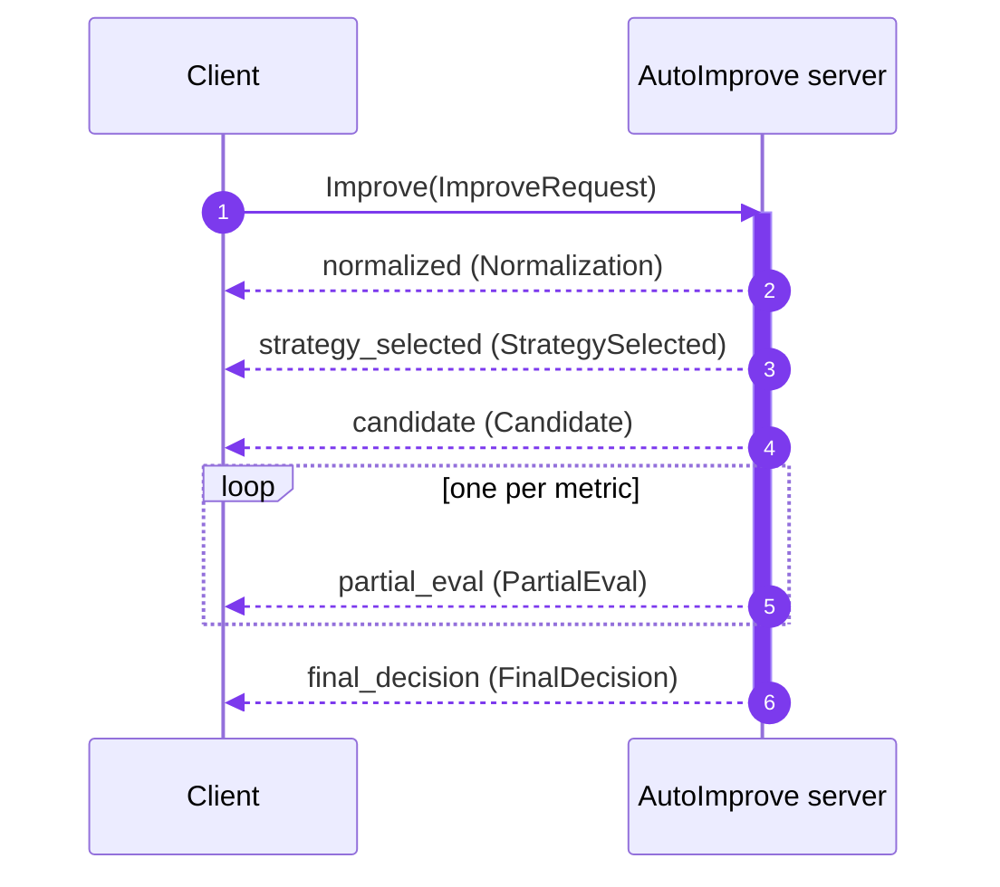

# gRPC API

Ծառայությունը նույն բարելավման pipeline-ը հասանելի է դարձնում gRPC-ի վրայով՝ որպես
**server-streaming** RPC, այնպես որ հաճախորդները ստանում են pipeline-ի յուրաքանչյուր փուլը հենց այն տեղի ունենալու պահին։

## Ծառայություն

```proto
service AutoImprove {
  rpc Improve(ImproveRequest) returns (stream ImproveEvent);
}
```

Կոնտրակտը գտնվում է
[`proto/autoimprove/v1/autoimprove.proto`](https://github.com/benzlokzik-university/prompt-autoimprove/blob/main/proto/autoimprove/v1/autoimprove.proto)
ֆայլում (package `autoimprove.v1`)։

## Server-ի գործարկումը

HTTP հավելվածը գործարկում է gRPC server-ը նույն պրոցեսում `50051` պորտի վրա լռելյայն,
այնպես որ `docker compose up`-ը (կամ `uvicorn …`-ը) արդեն սպասարկում է gRPC-ն։ Այն
ինքնուրույն գործարկելու համար՝

```bash
uv run pai serve-grpc
# or
uv run python -m prompt_autoimprove.api.grpc.server
```

| Փոփոխական | Լռելյայն | Նպատակ |
| --- | --- | --- |
| `PAI_API__GRPC_ENABLED` | `true` | Գործարկել ներգործընթաց gRPC server-ը HTTP հավելվածի հետ։ |
| `PAI_API__GRPC_PORT` | `50051` | Լսելու պորտը։ |

Server-ն օգտագործում է անապահով (plaintext) պորտ — production-ի համար TLS-ը terminate
արեք proxy-ի վրա։ Այն ենթադրում է մեկ պրոցես. multi-worker HTTP deployment-ների համար
gRPC-ն գործարկեք առանձին՝ `pai serve-grpc`-ով։

## Հարցում

`ImproveRequest`՝

| Դաշտ | Type | Նշումներ |
| --- | --- | --- |
| `prompt` | string | Բարելավման ենթակա prompt-ը (պարտադիր)։ |
| `profile` | string | Պրոֆիլի անունը (օր.՝ `qwen3-7b`) կամ ընտանիքը (օր.՝ `qwen`)։ |
| `locale_hint` | string | Ոչ պարտադիր լեզվի հուշում, օր.՝ `en`, `ru`։ |
| `sensitive` | bool | Պահել ուղղորդումը լոկալ մոդելների վրա և բաց թողնել LLM վերաշարադրումը։ |
| `attachments` | repeated `Attachment` | `modality`, `uri`, `mime_type`, `bytes_size`։ |

## Պատասխանի հոսք



Յուրաքանչյուր `ImproveEvent` ունի `stage` string և `oneof body`։ Փուլերը գալիս են
հերթականությամբ՝

| `stage` | `body` | Բովանդակություն |
| --- | --- | --- |
| `normalized` | `Normalization` | `language`, `task`, `missing_parameters`, `safety_flags` |
| `strategy_selected` | `StrategySelected` | `strategy`, `reason` |
| `candidate` | `Candidate` | `text`, `rationale`, `estimated_tokens` |
| `partial_eval` | `PartialEval` | `metric`, `value`, `weight` (մեկ event յուրաքանչյուր metric-ի համար) |
| `final_decision` | `FinalDecision` | `integrated_score`, `explanation`, `adapter`, `profile` |

## Python հաճախորդ

Գեներացված stub-երը մատակարարվում են package-ի հետ, այնպես որ հաճախորդը կարող է դրանք ուղղակիորեն import անել՝

```python
import asyncio
import grpc

import prompt_autoimprove.api.grpc.generated  # noqa: F401  (registers the path)
from autoimprove.v1 import autoimprove_pb2 as pb
from autoimprove.v1 import autoimprove_pb2_grpc as pb_grpc


async def main() -> None:
    async with grpc.aio.insecure_channel("localhost:50051") as channel:
        stub = pb_grpc.AutoImproveStub(channel)
        request = pb.ImproveRequest(
            prompt="Summarize the benefits of microservices",
            profile="qwen3-7b",
            locale_hint="en",
        )
        async for event in stub.Improve(request):
            print(event.stage)
            if event.stage == "final_decision":
                print(event.final_decision.integrated_score)
                print(event.final_decision.explanation)


asyncio.run(main())
```

## Stub-երի վերագեներացում

`.proto`-ն խմբագրելուց հետո վերագեներացրեք Python stub-երը՝

```bash
./scripts/gen_proto.sh
```

Այլ լեզուների համար `proto/autoimprove/v1/autoimprove.proto`-ն կոմպիլյացիա արեք ձեր
սեփական `protoc` toolchain-ով։

## Սխալների կոդեր

| gRPC status | Երբ |
| --- | --- |
| `NOT_FOUND` | Հարցված պրոֆիլը գոյություն չունի։ |
| `FAILED_PRECONDITION` | Ոչ մի թեկնածու չանցավ վալիդացիան (pipeline-ի սխալ)։ |
| `UNAVAILABLE` | Պրոֆիլ ընտրվեց, բայց ոչ մի adapter չկարողացավ սպասարկել այն։ |

## Արագ ստուգում grpcurl-ով

Server-ը reflection-ը միացված չունի, այնպես որ proto-ն փոխանցեք բացահայտ՝

```bash
grpcurl -plaintext \
  -proto proto/autoimprove/v1/autoimprove.proto \
  -d '{"prompt": "Summarize this", "profile": "qwen3-7b"}' \
  localhost:50051 autoimprove.v1.AutoImprove/Improve
```
