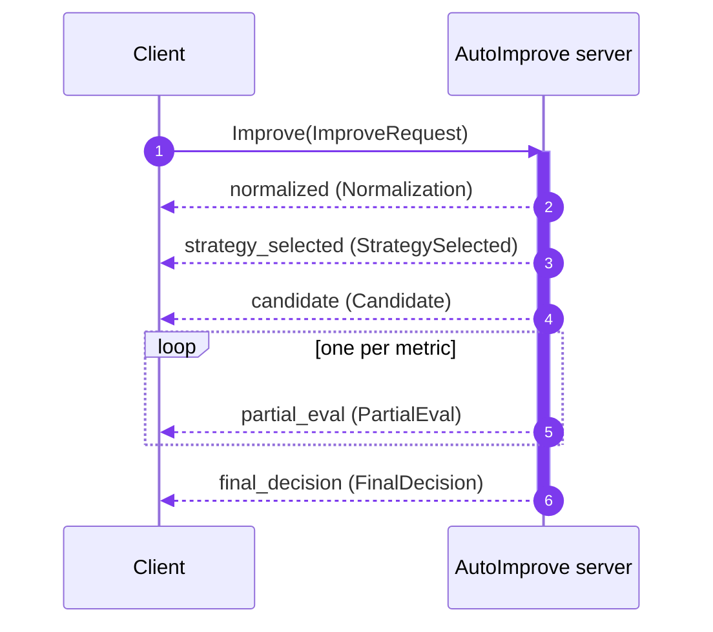

# gRPC API

The service exposes the same improvement pipeline over gRPC as a
**server-streaming** RPC, so clients receive each pipeline stage as it happens.

## Service

```proto
service AutoImprove {
  rpc Improve(ImproveRequest) returns (stream ImproveEvent);
}
```

The contract lives in
[`proto/autoimprove/v1/autoimprove.proto`](https://github.com/benzlokzik-university/prompt-autoimprove/blob/main/proto/autoimprove/v1/autoimprove.proto)
(package `autoimprove.v1`).

## Running the server

The HTTP app starts the gRPC server in the same process on port `50051` by
default, so `docker compose up` (or `uvicorn …`) already serves gRPC. To run it
standalone:

```bash
uv run pai serve-grpc
# or
uv run python -m prompt_autoimprove.api.grpc.server
```

| Variable | Default | Purpose |
| --- | --- | --- |
| `PAI_API__GRPC_ENABLED` | `true` | Start the in-process gRPC server with the HTTP app. |
| `PAI_API__GRPC_PORT` | `50051` | Listen port. |

The server uses an insecure (plaintext) port — terminate TLS at a proxy for
production. It assumes a single process; for multi-worker HTTP deployments run
gRPC separately with `pai serve-grpc`.

## Request

`ImproveRequest`:

| Field | Type | Notes |
| --- | --- | --- |
| `prompt` | string | The prompt to improve (required). |
| `profile` | string | Profile name (e.g. `qwen3-7b`) or family (e.g. `qwen`). |
| `locale_hint` | string | Optional language hint, e.g. `en`, `ru`. |
| `sensitive` | bool | Keep routing on local models and skip the LLM rewrite. |
| `attachments` | repeated `Attachment` | `modality`, `uri`, `mime_type`, `bytes_size`. |

## Response stream



Each `ImproveEvent` has a `stage` string and a `oneof body`. Stages arrive in
order:

| `stage` | `body` | Contents |
| --- | --- | --- |
| `normalized` | `Normalization` | `language`, `task`, `missing_parameters`, `safety_flags` |
| `strategy_selected` | `StrategySelected` | `strategy`, `reason` |
| `candidate` | `Candidate` | `text`, `rationale`, `estimated_tokens` |
| `partial_eval` | `PartialEval` | `metric`, `value`, `weight` (one event per metric) |
| `final_decision` | `FinalDecision` | `integrated_score`, `explanation`, `adapter`, `profile` |

## Python client

The generated stubs ship in the package, so a client can import them directly:

```python
import asyncio
import grpc

import prompt_autoimprove.api.grpc.generated  # noqa: F401  (registers the path)
from autoimprove.v1 import autoimprove_pb2 as pb
from autoimprove.v1 import autoimprove_pb2_grpc as pb_grpc


async def main() -> None:
    async with grpc.aio.insecure_channel("localhost:50051") as channel:
        stub = pb_grpc.AutoImproveStub(channel)
        request = pb.ImproveRequest(
            prompt="Summarize the benefits of microservices",
            profile="qwen3-7b",
            locale_hint="en",
        )
        async for event in stub.Improve(request):
            print(event.stage)
            if event.stage == "final_decision":
                print(event.final_decision.integrated_score)
                print(event.final_decision.explanation)


asyncio.run(main())
```

## Regenerating stubs

After editing the `.proto`, regenerate the Python stubs:

```bash
./scripts/gen_proto.sh
```

For other languages, compile `proto/autoimprove/v1/autoimprove.proto` with your
own `protoc` toolchain.

## Error codes

| gRPC status | When |
| --- | --- |
| `NOT_FOUND` | The requested profile does not exist. |
| `FAILED_PRECONDITION` | No candidate survived validation (pipeline error). |
| `UNAVAILABLE` | A profile was chosen but no adapter could serve it. |

## Quick check with grpcurl

The server does not enable reflection, so pass the proto explicitly:

```bash
grpcurl -plaintext \
  -proto proto/autoimprove/v1/autoimprove.proto \
  -d '{"prompt": "Summarize this", "profile": "qwen3-7b"}' \
  localhost:50051 autoimprove.v1.AutoImprove/Improve
```
