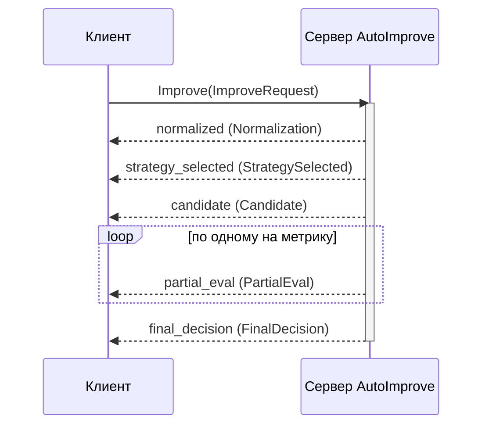

# gRPC API

Сервис предоставляет тот же пайплайн улучшения по gRPC как **server-streaming**
RPC, поэтому клиент получает каждую стадию пайплайна по мере выполнения.

## Сервис

```proto
service AutoImprove {
  rpc Improve(ImproveRequest) returns (stream ImproveEvent);
}
```

Контракт находится в
[`proto/autoimprove/v1/autoimprove.proto`](https://github.com/benzlokzik-university/prompt-autoimprove/blob/main/proto/autoimprove/v1/autoimprove.proto)
(пакет `autoimprove.v1`).

## Запуск сервера

HTTP-приложение по умолчанию запускает gRPC-сервер в том же процессе на порту
`50051`, поэтому `docker compose up` (или `uvicorn …`) уже отдаёт gRPC. Запуск
отдельно:

```bash
uv run pai serve-grpc
# или
uv run python -m prompt_autoimprove.api.grpc.server
```

| Переменная | По умолчанию | Назначение |
| --- | --- | --- |
| `PAI_API__GRPC_ENABLED` | `true` | Запускать встроенный gRPC-сервер с HTTP-приложением. |
| `PAI_API__GRPC_PORT` | `50051` | Порт прослушивания. |

Сервер использует незащищённый (plaintext) порт — терминируйте TLS на прокси для
продакшена. Он рассчитан на один процесс; для многопроцессных HTTP-развертываний
запускайте gRPC отдельно через `pai serve-grpc`.

## Запрос

`ImproveRequest`:

| Поле | Тип | Примечания |
| --- | --- | --- |
| `prompt` | string | Промпт для улучшения (обязательно). |
| `profile` | string | Имя профиля (например, `qwen3-7b`) или семейство (например, `qwen`). |
| `locale_hint` | string | Подсказка языка, например `en`, `ru`. |
| `sensitive` | bool | Оставлять маршрутизацию на локальных моделях и пропускать LLM-переписывание. |
| `attachments` | repeated `Attachment` | `modality`, `uri`, `mime_type`, `bytes_size`. |

## Поток ответа



У каждого `ImproveEvent` есть строка `stage` и `oneof body`. Стадии приходят по
порядку:

| `stage` | `body` | Содержимое |
| --- | --- | --- |
| `normalized` | `Normalization` | `language`, `task`, `missing_parameters`, `safety_flags` |
| `strategy_selected` | `StrategySelected` | `strategy`, `reason` |
| `candidate` | `Candidate` | `text`, `rationale`, `estimated_tokens` |
| `partial_eval` | `PartialEval` | `metric`, `value`, `weight` (по событию на метрику) |
| `final_decision` | `FinalDecision` | `integrated_score`, `explanation`, `adapter`, `profile` |

## Python-клиент

Сгенерированные стабы поставляются в пакете, поэтому их можно импортировать
напрямую:

```python
import asyncio
import grpc

import prompt_autoimprove.api.grpc.generated  # noqa: F401  (регистрирует путь)
from autoimprove.v1 import autoimprove_pb2 as pb
from autoimprove.v1 import autoimprove_pb2_grpc as pb_grpc


async def main() -> None:
    async with grpc.aio.insecure_channel("localhost:50051") as channel:
        stub = pb_grpc.AutoImproveStub(channel)
        request = pb.ImproveRequest(
            prompt="Резюмируй преимущества микросервисов",
            profile="qwen3-7b",
            locale_hint="ru",
        )
        async for event in stub.Improve(request):
            print(event.stage)
            if event.stage == "final_decision":
                print(event.final_decision.integrated_score)
                print(event.final_decision.explanation)


asyncio.run(main())
```

## Регенерация стабов

После изменения `.proto` перегенерируйте Python-стабы:

```bash
./scripts/gen_proto.sh
```

Для других языков скомпилируйте `proto/autoimprove/v1/autoimprove.proto` своим
инструментарием `protoc`.

## Коды ошибок

| gRPC-статус | Когда |
| --- | --- |
| `NOT_FOUND` | Запрошенный профиль не существует. |
| `FAILED_PRECONDITION` | Ни один кандидат не прошёл валидацию (ошибка пайплайна). |
| `UNAVAILABLE` | Профиль выбран, но ни один адаптер не может его обслужить. |

## Быстрая проверка через grpcurl

Сервер не включает reflection, поэтому укажите proto явно:

```bash
grpcurl -plaintext \
  -proto proto/autoimprove/v1/autoimprove.proto \
  -d '{"prompt": "Summarize this", "profile": "qwen3-7b"}' \
  localhost:50051 autoimprove.v1.AutoImprove/Improve
```
